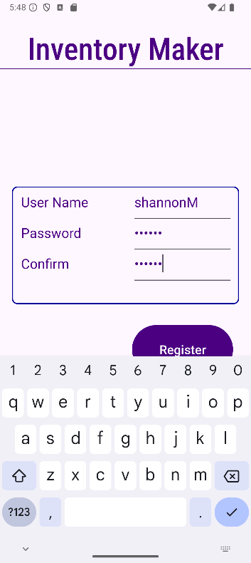
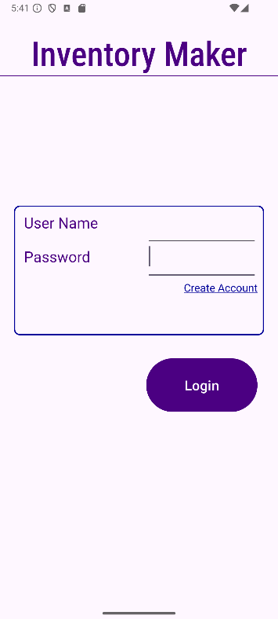
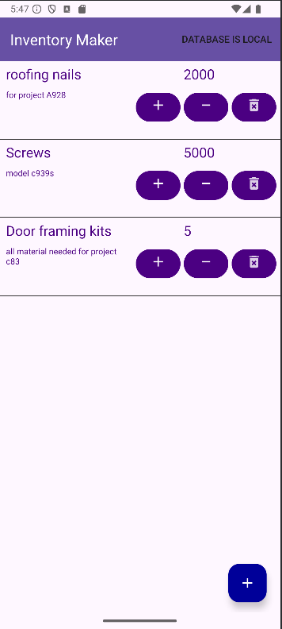
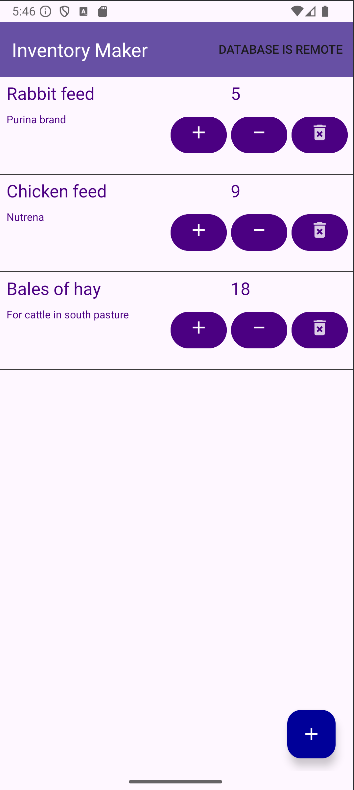
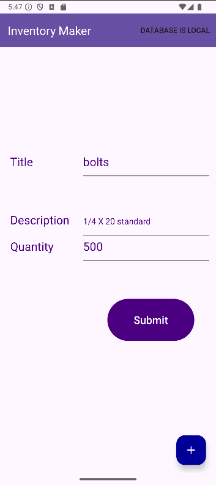

# Inventory App

## About the Project

The Inventory App is an Android application built with Java in Android Studio, designed to manage inventory items for authenticated users. It supports:
User authentication (login and registration) with SHA-256 password hashing.

CRUD operations (create, read, update, delete) for inventory items, stored either locally in an SQLite database or remotely via a Web API.

A RecyclerView-based UI to display items in a grid, with options to add, increment, decrement, or delete items.

Toggling between local and remote database modes, with remote operations authenticated using an AES-encrypted API key.

The app uses a local SQLite database for offline storage and connects to a remote InventoryAppRemoteAPI (hosted at https://10.0.2.2:7113/api/Inventory/) for cloud-based inventory management, ensuring flexibility and data accessibility.

## Motivation

Manually managing inventory is time-consuming and error-prone, especially for users needing to track items across multiple devices or locations. The Inventory App automates this process by providing a user-friendly mobile interface for managing inventory, with secure authentication and the ability to switch between local and remote data storage. This ensures data integrity, accessibility, and convenience for users.

## Getting Started

To get started with the Inventory App, follow these steps:
Ensure the required environment is set up (see Installation (#installation)).

Clone or download the project files to a local directory.

Configure the local SQLite database (automatically created) and/or the remote API (requires a running instance of InventoryAppRemoteAPI).

Build and run the app in Android Studio.

## Use the app to:

Login or Register: Authenticate or create a user account.

View Items: Display all inventory items for the logged-in user in a grid.
Toggle Database Mode: Switch between local and remote database modes via the toolbar.
Manage Items: Increment, decrement, or delete items, with notifications for zero quantity.

Local DB notice toggle text at top, indicated database used.

New database toggled, notice new items and text indicating database used.

Add Item: Create a new item with title, description, and quantity.

## Installation

To set up the environment:
Install Android Studio (e.g., Arctic Fox or later).

Ensure the Android SDK is installed, with support for Android API level compatible with the app (e.g., API 30 or higher).

Add the following dependencies to build.gradle (app module):
gradle

implementation 'androidx.appcompat:appcompat:1.6.1'
implementation 'androidx.recyclerview:recyclerview:1.3.2'
implementation 'com.google.android.material:material:1.12.0'
implementation 'com.squareup.okhttp3:okhttp:4.12.0'
implementation 'com.google.code.gson:gson:2.10.1'

Clone or download the project files to a local directory.

For remote mode, ensure the InventoryAppRemoteAPI is running at https://10.0.2.2:7113 (or update RemoteRepo.java with the correct URL). The API requires a valid AES-encrypted key, stored in string resources (R.string.api_key, R.string.aes_key, R.string.aes_iv).

Create the string resources in res/values/strings.xml:
xml

<string name="api_key">your_api_key</string>
<string name="aes_key">your_aes_key_32_chars_1234567890ab</string>
<string name="aes_iv">your_iv_16_chars12</string>

Contact the project maintainer for the correct API key values.

Build and run the app on an emulator or device:
bash

./gradlew build

Use Android Studio’s “Run” button to deploy the app.

For remote mode, ensure the emulator uses 10.0.2.2 to access the host machine’s API, and the API’s SSL certificate (localhost.pfx) is trusted.

## Usage

The Inventory App supports the following primary use cases:
User Authentication: Users can log in with a username and password or register a new account. Passwords are hashed using SHA-256 for security.

View Inventory: Displays all items for the logged-in user in a RecyclerView grid, showing title, description, and quantity.

Add Item: Allows users to create new items with a title, description, and quantity (defaults to 1 if invalid).

Manage Items: Users can increment or decrement item quantities or delete items, with automatic notifications when quantities reach zero.

Toggle Database Mode: Switch between local SQLite storage and remote API storage via a toolbar menu option.

Important: Remote mode requires a running instance of InventoryAppRemoteAPI and a valid encrypted API key. Local mode uses an SQLite database (Inventory.db) created automatically on the device.
Code Example
Below are examples of key functionality based on the provided source code.
Example A: User Login
The LoginActivity authenticates users by comparing their credentials against the database.
java

submitRegisterButton.setOnClickListener(v -> {
    String buttonText = submitRegisterButton.getText().toString();
    if (buttonText.equals("Register")) {
        // Handle registration
        String password = passwordEditText.getText().toString();
        String confirmPassword = confirmEditText.getText().toString();
        if (password.equals(confirmPassword)) {
            User user = new User(0, userEditText.getText().toString(), password, null);
            List<User> users = getUsers();
            boolean hasUser = false;
            for (User existingUser : users) {
                if (Objects.equals(existingUser.getUser(), user.getUser())) {
                    hasUser = true;
                    break;
                }
            }
            if (!hasUser) {
                boolean isSuccessful = createUser(user);
                if (isSuccessful) {
                    Toast.makeText(getApplication(), "Success", Toast.LENGTH_SHORT).show();
                    // Reset UI
                }
            }
        }
    } else {
        // Handle login
        User user = new User(0, userEditText.getText().toString(), passwordEditText.getText().toString(), null);
        User dbUser = getDbUser(userEditText.getText().toString());
        boolean isAuthenticated = user.equals(dbUser);
        if (isAuthenticated && dbUser != null) {
            int userId = dbUser.getId();
            Intent intent = new Intent(LoginActivity.this, MainActivity.class);
            intent.putExtra("USER_ID", userId);
            startActivity(intent);
        }
    }
});

This validates usernames and passwords (hashed with SHA-256) and redirects authenticated users to MainActivity.
Example B: Display Inventory Items
The InventoryItemAdapter binds item data to a RecyclerView for display.
java

@Override
public void onBindViewHolder(@NonNull ViewHolder holder, int position) {
    InventoryItem item = items.get(position);
    holder.titleTextView.setText(item.getTitle());
    holder.descTextView.setText(item.getDescription());
    holder.qtyTextView.setText(String.valueOf(item.getQuantity()));
    holder.delButton.setOnClickListener(v -> {
        if (myListener != null) {
            myListener.onDelButtonClick(holder.getAbsoluteAdapterPosition());
        }
    });
    holder.decButton.setOnClickListener(v -> {
        if (myListener != null) {
            myListener.onDecButtonClick(holder.getAbsoluteAdapterPosition());
        }
    });
    holder.incButton.setOnClickListener(v -> {
        if (myListener != null) {
            myListener.onIncButtonClick(holder.getAbsoluteAdapterPosition());
        }
    });
}

This populates each RecyclerView row with an item’s title, description, and quantity, and sets up click listeners for management actions.
Example C: Remote API Interaction
The RemoteRepo creates inventory items via the remote API.
java

public int createInventoryItem(InventoryItem item) throws IOException, InvalidAlgorithmParameterException,
        NoSuchPaddingException, IllegalBlockSizeException, NoSuchAlgorithmException,
        BadPaddingException, InvalidKeyException {
    String apiKey = getEncryption();
    String json = gson.toJson(item);
    RequestBody body = RequestBody.create(json, JSON);
    Request request = new Request.Builder()
            .url(BASE_URL)
            .addHeader("X-encrypted-api-key", apiKey)
            .post(body)
            .build();
    try (Response response = client.newCall(request).execute()) {
        if (response.isSuccessful() && response.body() != null) {
            return Integer.parseInt(response.body().string());
        }
    }
    return 0;
}

This sends a POST request to the remote API with an AES-encrypted API key, creating a new inventory item.

## Contact

Shannon Musgrave
shannon.musgrave@snhu.edu (mailto:shannon.musgrave@snhu.edu)

